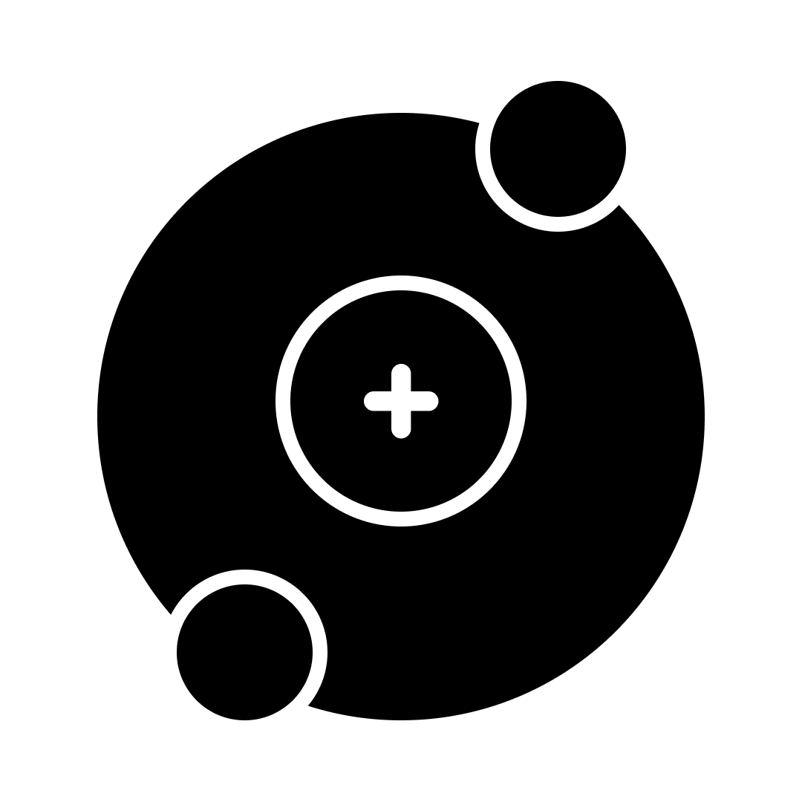

# Proton


<a href="#"></a>
<br>
A utility-first CSS framework that supports grid and flexbox out of the box for rapidly building custom user interfaces. 
<br>
# Documentation

## Installation

### Via Npm

```
npm install proton.css
```

<span style="color:red;">OR</span>

```
yarn add proton.css
````

**Usage**

```
import 'proton.css/dist/minified/proton.css'
import 'proton.css/dist/minified/colors.css'
import 'proton.css/dist/minified/typo.css'
```

### Via CDN

```
<link rel="stylesheet" href="https://unpkg.com/proton.css@1.0.1/dist/minified/proton.css">
<link rel="stylesheet" href="https://unpkg.com/proton.css@1.0.1/dist/minified/colors.css">
<link rel="stylesheet" href="https://unpkg.com/proton.css@1.0.1/dist/minified/typo.css">
```

## More docs will be updated soon.

# Contribution
If you want to contribute to this CSS framework then you can DM <a href="https://instagram.com/iamharsh.dev">iamharsh.dev</a> and ask to join the team.
